# 实验四 Logstash操作

### 学院：省级示范性软件学院

### 题目：《实验四 Logstash操作》

### 姓名：晏仕民

### 学号：2200770068

### 班级：软工2201

### 日期：2024-10-25

### 实验环境： elasticsearch-8.12.2   kibana-8.12.2

## 一、实验目的：

### 掌握Elasticsearch Logstash操作方法

## 二、实验内容：

### tomcat日志处理 
***要求：***

***1. 将tomcat的logs中的localhost_access_log访问日志导入到本地的elasticsearch中。***

***2. 数据导入到一个名为tomcat_logs的索引。***

***3. 在elasticsearch中做5个日志相关的分析，题目自拟。***
***
### 数据转换和传输
***要求：***

***1. 将本地的mysql数据库中的一张表导入到本地的elasticsearch中。***

***2. 数据库表更新后，数据能够自动同步到elasticsearch中。***
***
### 创建 Logstash 配置文件--goto.conf
```
input {
  file {
    path => "D:/tomcat_logs/localhost_access_log.*"
    start_position => "beginning"
    sincedb_path => "D:/logstash-8.12.2/sincedb"  # 指定有效的 sincedb 路径
  }
}

filter {
  grok {
    match => { "message" => "%{IPORHOST:client_ip} - - \[%{HTTPDATE:timestamp}\] \"%{WORD:method} %{URIPATHPARAM:request} HTTP/%{NUMBER:http_version}\" %{NUMBER:response_code} %{NUMBER:response_size}" }
  }

  date {
    match => ["timestamp", "dd/MMM/yyyy:HH:mm:ss Z"]
    target => "@timestamp"
  }
}

output {
  elasticsearch {
    hosts => ["http://localhost:9200"]
    index => "tomcat_logs"
  }
}

```
### 在命令行中运行 Logstash 并加载配置文件： .\bin\logstash -f D:\logstash-8.12.2\config\goto.conf
### 示例图片--
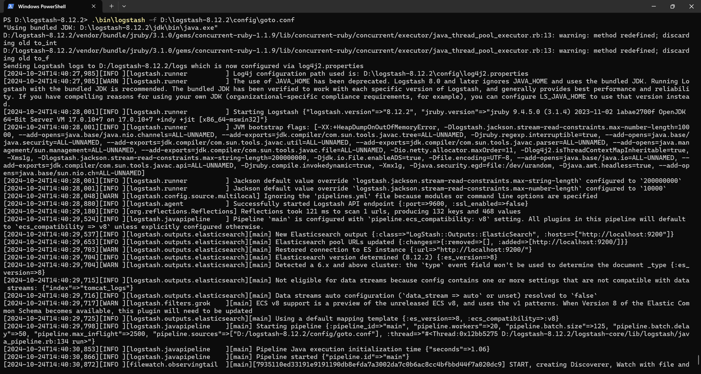
### 查看索引--
```
GET tomcat_logs/_mapping
```
### 结果--
```
{
  "tomcat_logs": {
    "mappings": {
      "properties": {
        "@timestamp": {
          "type": "date"
        },
        "@version": {
          "type": "text",
          "fields": {
            "keyword": {
              "type": "keyword",
              "ignore_above": 256
            }
          }
        },
        "client_ip": {
          "type": "text",
          "fields": {
            "keyword": {
              "type": "keyword",
              "ignore_above": 256
            }
          }
        },
        "event": {
          "properties": {
            "original": {
              "type": "text",
              "fields": {
                "keyword": {
                  "type": "keyword",
                  "ignore_above": 256
                }
              }
            }
          }
        },
        "host": {
          "properties": {
            "name": {
              "type": "text",
              "fields": {
                "keyword": {
                  "type": "keyword",
                  "ignore_above": 256
                }
              }
            }
          }
        },
        "http_version": {
          "type": "text",
          "fields": {
            "keyword": {
              "type": "keyword",
              "ignore_above": 256
            }
          }
        },
        "log": {
          "properties": {
            "file": {
              "properties": {
                "path": {
                  "type": "text",
                  "fields": {
                    "keyword": {
                      "type": "keyword",
                      "ignore_above": 256
                    }
                  }
                }
              }
            }
          }
        },
        "message": {
          "type": "text",
          "fields": {
            "keyword": {
              "type": "keyword",
              "ignore_above": 256
            }
          }
        },
        "method": {
          "type": "text",
          "fields": {
            "keyword": {
              "type": "keyword",
              "ignore_above": 256
            }
          }
        },
        "request": {
          "type": "text",
          "fields": {
            "keyword": {
              "type": "keyword",
              "ignore_above": 256
            }
          }
        },
        "response_code": {
          "type": "text",
          "fields": {
            "keyword": {
              "type": "keyword",
              "ignore_above": 256
            }
          }
        },
        "response_size": {
          "type": "text",
          "fields": {
            "keyword": {
              "type": "keyword",
              "ignore_above": 256
            }
          }
        },
        "timestamp": {
          "type": "text",
          "fields": {
            "keyword": {
              "type": "keyword",
              "ignore_above": 256
            }
          }
        }
      }
    }
  }
}
```
### 示例图片--
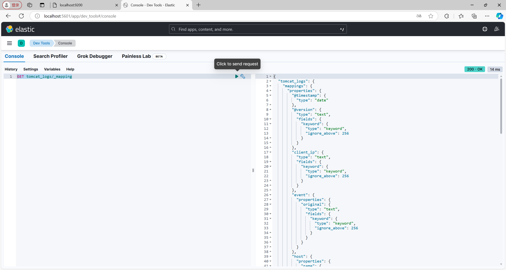
### 日志分析--1.统计每个响应码的出现次数
```
GET tomcat_logs/_search
{
  "size": 0,
  "aggs": {
    "response_codes": {
      "terms": {
        "field": "response_code.keyword"
      }
    }
  }
}
```

### 结果--
```
{
  "took": 2,
  "timed_out": false,
  "_shards": {
    "total": 1,
    "successful": 1,
    "skipped": 0,
    "failed": 0
  },
  "hits": {
    "total": {
      "value": 3000,
      "relation": "eq"
    },
    "max_score": null,
    "hits": []
  },
  "aggregations": {
    "response_codes": {
      "doc_count_error_upper_bound": 0,
      "sum_other_doc_count": 0,
      "buckets": [
        {
          "key": "500",
          "doc_count": 781
        },
        {
          "key": "200",
          "doc_count": 749
        },
        {
          "key": "404",
          "doc_count": 738
        },
        {
          "key": "302",
          "doc_count": 732
        }
      ]
    }
  }
}
```
### 示例图片--
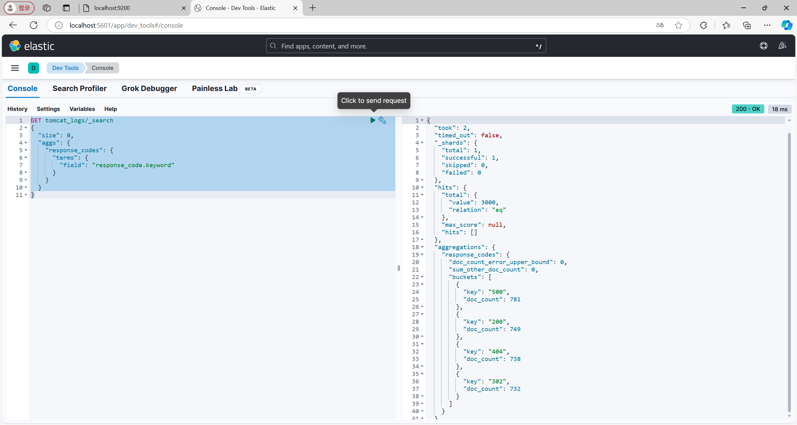

### 日志分析--2.统计每种 HTTP 方法的出现次数
```
GET tomcat_logs/_search
{
  "size": 0,
  "aggs": {
    "http_methods": {
      "terms": {
        "field": "method.keyword"
      }
    }
  }
}
```

### 结果--
```
{
  "took": 1,
  "timed_out": false,
  "_shards": {
    "total": 1,
    "successful": 1,
    "skipped": 0,
    "failed": 0
  },
  "hits": {
    "total": {
      "value": 3000,
      "relation": "eq"
    },
    "max_score": null,
    "hits": []
  },
  "aggregations": {
    "http_methods": {
      "doc_count_error_upper_bound": 0,
      "sum_other_doc_count": 0,
      "buckets": [
        {
          "key": "POST",
          "doc_count": 1547
        },
        {
          "key": "GET",
          "doc_count": 1453
        }
      ]
    }
  }
}
```
### 示例图片--
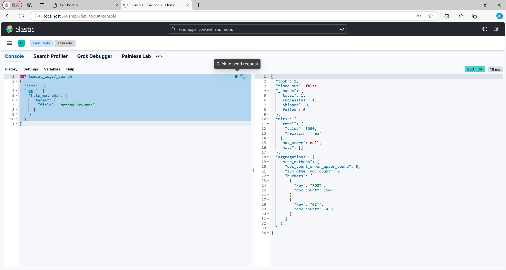

### 日志分析--3.统计每个客户端 IP 的出现次数
```
GET tomcat_logs/_search
{
  "size": 0,
  "aggs": {
    "client_ips": {
      "terms": {
        "field": "client_ip.keyword"
      }
    }
  }
}
```

### 结果--
```
{
  "took": 1,
  "timed_out": false,
  "_shards": {
    "total": 1,
    "successful": 1,
    "skipped": 0,
    "failed": 0
  },
  "hits": {
    "total": {
      "value": 3000,
      "relation": "eq"
    },
    "max_score": null,
    "hits": []
  },
  "aggregations": {
    "client_ips": {
      "doc_count_error_upper_bound": 0,
      "sum_other_doc_count": 0,
      "buckets": [
        {
          "key": "0:0:0:0:0:0:0:1",
          "doc_count": 3000
        }
      ]
    }
  }
}
```
### 示例图片--
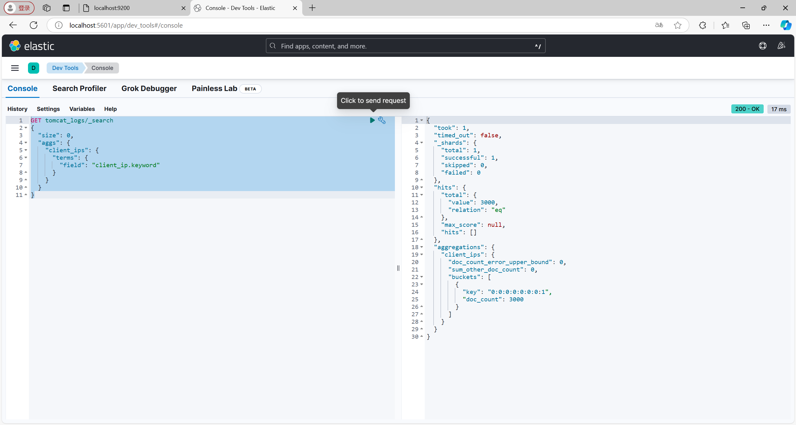

### 日志分析--4.统计日志条目的数量
```
GET tomcat_logs/_search
{
  "size": 0,
  "aggs": {
    "top_messages": {
      "terms": {
        "field": "message.keyword",  // 使用.keyword字段
        "size": 10
      }
    }
  }
}
```

### 结果--
```
{
  "took": 1,
  "timed_out": false,
  "_shards": {
    "total": 1,
    "successful": 1,
    "skipped": 0,
    "failed": 0
  },
  "hits": {
    "total": {
      "value": 3000,
      "relation": "eq"
    },
    "max_score": null,
    "hits": []
  },
  "aggregations": {
    "top_messages": {
      "doc_count_error_upper_bound": 0,
      "sum_other_doc_count": 2976,
      "buckets": [
        {
          "key": """0:0:0:0:0:0:0:1 - - [25/Sep/2024:11:12:31 +0800] "POST /demo/ HTTP/1.1" 302 292
""",
          "doc_count": 3
        },
        {
          "key": """0:0:0:0:0:0:0:1 - - [27/Sep/2024:11:12:31 +0800] "GET /examples/jsp/images/execute.gif HTTP/1.1" 500 13
""",
          "doc_count": 3
        },
        {
          "key": """0:0:0:0:0:0:0:1 - - [29/Sep/2024:11:12:31 +0800] "POST /demo HTTP/1.1" 404 99
""",
          "doc_count": 3
        },
        {
          "key": """0:0:0:0:0:0:0:1 - - [31/Aug/2024:11:12:31 +0800] "POST /examples/jsp/images/return.gif HTTP/1.1" 404 99
""",
          "doc_count": 3
        },
        {
          "key": """0:0:0:0:0:0:0:1 - - [01/Oct/2024:11:12:31 +0800] "GET /blog/post/3 HTTP/1.1" 200 1231
""",
          "doc_count": 2
        },
        {
          "key": """0:0:0:0:0:0:0:1 - - [01/Oct/2024:11:12:31 +0800] "GET /products/item/123 HTTP/1.1" 404 1242
""",
          "doc_count": 2
        },
        {
          "key": """0:0:0:0:0:0:0:1 - - [01/Oct/2024:11:12:31 +0800] "GET /products/item/456 HTTP/1.1" 500 13
""",
          "doc_count": 2
        },
        {
          "key": """0:0:0:0:0:0:0:1 - - [01/Oct/2024:11:12:31 +0800] "GET /static/js/app.js HTTP/1.1" 500 292
""",
          "doc_count": 2
        },
        {
          "key": """0:0:0:0:0:0:0:1 - - [01/Oct/2024:11:12:31 +0800] "POST /static/css/style.css HTTP/1.1" 200 99
""",
          "doc_count": 2
        },
        {
          "key": """0:0:0:0:0:0:0:1 - - [03/Oct/2024:11:12:31 +0800] "POST /demo1 HTTP/1.1" 200 0
""",
          "doc_count": 2
        }
      ]
    }
  }
}
```
### 示例图片--
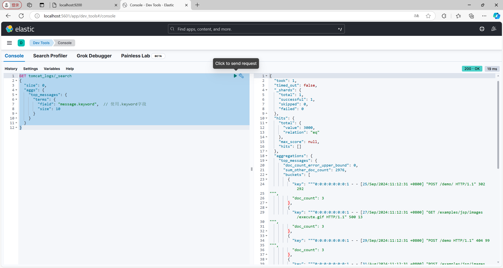

### 日志分析--5.统计每个请求的 URL 出现次数
```
GET tomcat_logs/_search
{
  "size": 0,
  "aggs": {
    "top_requests": {
      "terms": {
        "field": "request.keyword",
        "size": 10  // 你可以根据需要调整返回的数量
      }
    }
  }
}
```

### 结果--
```
{
  "took": 2,
  "timed_out": false,
  "_shards": {
    "total": 1,
    "successful": 1,
    "skipped": 0,
    "failed": 0
  },
  "hits": {
    "total": {
      "value": 3000,
      "relation": "eq"
    },
    "max_score": null,
    "hits": []
  },
  "aggregations": {
    "top_requests": {
      "doc_count_error_upper_bound": 0,
      "sum_other_doc_count": 1664,
      "buckets": [
        {
          "key": "/demo1/",
          "doc_count": 153
        },
        {
          "key": "/examples/jsp/images/execute.gif",
          "doc_count": 141
        },
        {
          "key": "/static/js/app.js",
          "doc_count": 139
        },
        {
          "key": "/about",
          "doc_count": 137
        },
        {
          "key": "/static/css/style.css",
          "doc_count": 134
        },
        {
          "key": "/demo/",
          "doc_count": 133
        },
        {
          "key": "/blog/post/2",
          "doc_count": 127
        },
        {
          "key": "/demo/hello",
          "doc_count": 127
        },
        {
          "key": "/examples/jsp/images/return.gif",
          "doc_count": 124
        },
        {
          "key": "/blog/post/3",
          "doc_count": 121
        }
      ]
    }
  }
}
```
### 示例图片--
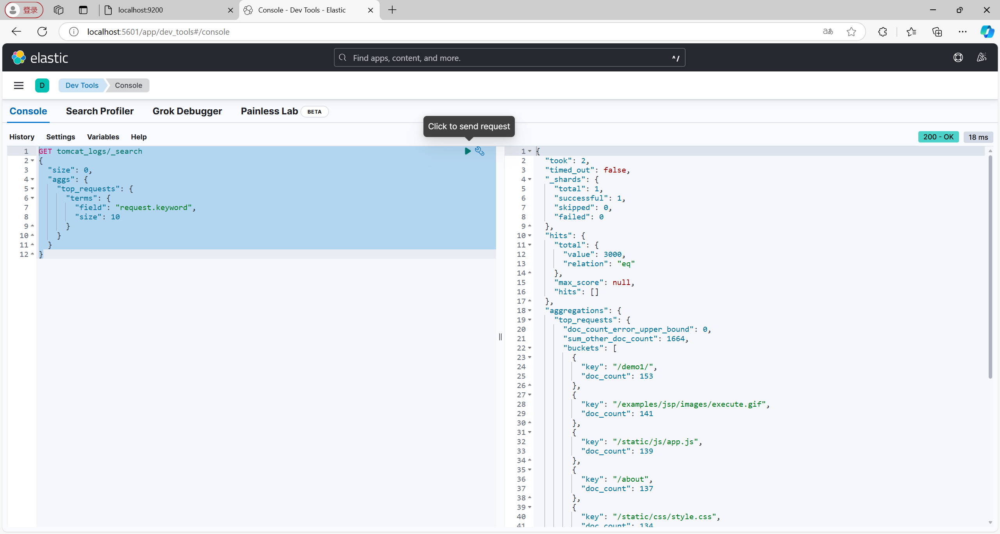
***
### 创建 Logstash 配置文件--sqlgoto.conf
```
input {
  jdbc {
    jdbc_driver_library => "D:/logstash-8.12.2/mysql-connector-j-9.1.0.jar"
    jdbc_driver_class => "com.mysql.cj.jdbc.Driver"
    jdbc_connection_string => "jdbc:mysql://localhost:3306/student"
    jdbc_user => "root"
    jdbc_password => "123456"
    statement => "SELECT * FROM student"
    schedule => "*/5 * * * * *" # 每5秒运行一次
  }
}

output {
  elasticsearch {
    hosts => ["http://localhost:9200"]
    index => "student"
    document_id => "%{student_id}" # 假设 student 表有一个 id 字段作为主键
  }
  stdout { codec => json_lines }
}

```
### 在命令行中运行 Logstash 并加载配置文件： .\bin\logstash -f D:\logstash-8.12.2\config\sqlgoto.conf
### 示例图片--
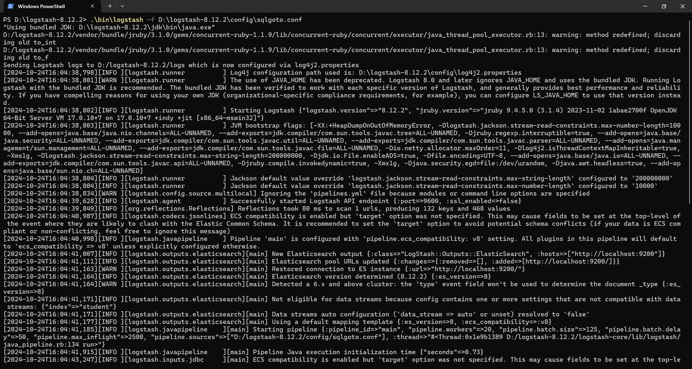
### 查看索引--
```
GET /student/_search
{
  "query": {
    
    "match_all": {}
    
  }
}
```
### 结果--
```
{
  "took": 826,
  "timed_out": false,
  "_shards": {
    "total": 1,
    "successful": 1,
    "skipped": 0,
    "failed": 0
  },
  "hits": {
    "total": {
      "value": 6,
      "relation": "eq"
    },
    "max_score": 1,
    "hits": [
      {
        "_index": "student",
        "_id": "004",
        "_score": 1,
        "_source": {
          "college": "B",
          "major": "F2",
          "class_name": "classB",
          "gender": "female",
          "id_card": "123459",
          "birthplace": "local",
          "@version": "1",
          "student_id": "004",
          "@timestamp": "2024-10-24T08:07:35.898443400Z",
          "name": "阿萨"
        }
      },
      {
        "_index": "student",
        "_id": "005",
        "_score": 1,
        "_source": {
          "college": "B",
          "major": "F2",
          "class_name": "classB",
          "gender": "female",
          "id_card": "123460",
          "birthplace": "local",
          "@version": "1",
          "student_id": "005",
          "@timestamp": "2024-10-24T08:07:35.898443400Z",
          "name": "雯雯"
        }
      },
      {
        "_index": "student",
        "_id": "001",
        "_score": 1,
        "_source": {
          "college": "A",
          "major": "F1",
          "class_name": "classA",
          "gender": "male",
          "id_card": "123456",
          "birthplace": "local",
          "@version": "1",
          "student_id": "001",
          "@timestamp": "2024-10-24T08:07:35.897444300Z",
          "name": "张三"
        }
      },
      {
        "_index": "student",
        "_id": "006",
        "_score": 1,
        "_source": {
          "college": "B",
          "major": "F2",
          "class_name": "classB",
          "gender": "female",
          "id_card": "123461",
          "birthplace": "local",
          "@version": "1",
          "student_id": "006",
          "@timestamp": "2024-10-24T08:07:35.898443400Z",
          "name": "刘思思"
        }
      },
      {
        "_index": "student",
        "_id": "002",
        "_score": 1,
        "_source": {
          "college": "A",
          "major": "F1",
          "class_name": "classA",
          "gender": "male",
          "id_card": "123457",
          "birthplace": "local",
          "@version": "1",
          "student_id": "002",
          "@timestamp": "2024-10-24T08:07:35.897444300Z",
          "name": "李四"
        }
      },
      {
        "_index": "student",
        "_id": "003",
        "_score": 1,
        "_source": {
          "college": "A",
          "major": "F1",
          "class_name": "classA",
          "gender": "male",
          "id_card": "123458",
          "birthplace": "local",
          "@version": "1",
          "student_id": "003",
          "@timestamp": "2024-10-24T08:07:35.898443400Z",
          "name": "王五"
        }
      }
    ]
  }
}
```
### 示例图片--
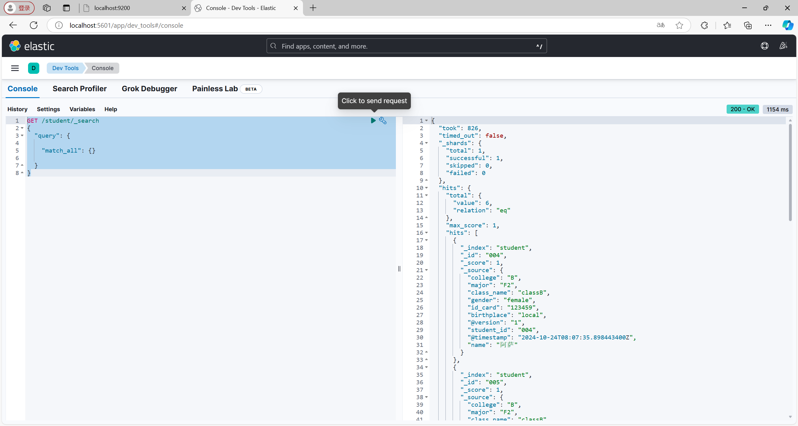
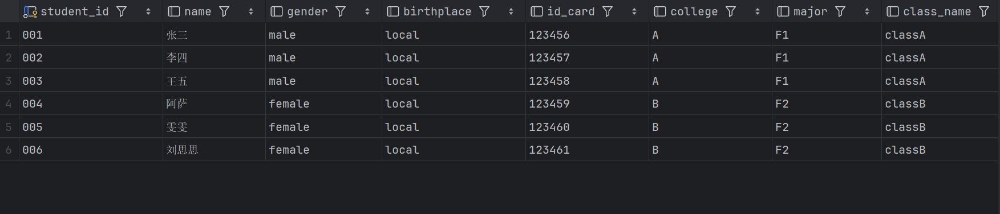
### 更新数据库后查看索引--
```
GET /student/_search
{
  "query": {
    
    "match_all": {}
    
  }
}
```
### 结果--
```
{
  "took": 821,
  "timed_out": false,
  "_shards": {
    "total": 1,
    "successful": 1,
    "skipped": 0,
    "failed": 0
  },
  "hits": {
    "total": {
      "value": 8,
      "relation": "eq"
    },
    "max_score": 1,
    "hits": [
      {
        "_index": "student",
        "_id": "006",
        "_score": 1,
        "_source": {
          "college": "B",
          "major": "F2",
          "class_name": "classB",
          "gender": "female",
          "id_card": "123461",
          "birthplace": "local",
          "@version": "1",
          "student_id": "006",
          "@timestamp": "2024-10-24T08:15:35.567884Z",
          "name": "刘思思"
        }
      },
      {
        "_index": "student",
        "_id": "007",
        "_score": 1,
        "_source": {
          "college": "B",
          "major": "F2",
          "class_name": "classB",
          "gender": "female",
          "id_card": "123462",
          "birthplace": "local",
          "@version": "1",
          "student_id": "007",
          "@timestamp": "2024-10-24T08:15:35.567884Z",
          "name": "悠悠"
        }
      },
      {
        "_index": "student",
        "_id": "008",
        "_score": 1,
        "_source": {
          "college": "A",
          "major": "F1",
          "class_name": "classA",
          "gender": "male",
          "id_card": "123463",
          "birthplace": "local",
          "@version": "1",
          "student_id": "008",
          "@timestamp": "2024-10-24T08:15:35.567884Z",
          "name": "周小川"
        }
      },
      {
        "_index": "student",
        "_id": "004",
        "_score": 1,
        "_source": {
          "college": "B",
          "major": "F2",
          "class_name": "classB",
          "gender": "female",
          "id_card": "123459",
          "birthplace": "local",
          "@version": "1",
          "student_id": "004",
          "@timestamp": "2024-10-24T08:15:35.567884Z",
          "name": "阿萨"
        }
      },
      {
        "_index": "student",
        "_id": "005",
        "_score": 1,
        "_source": {
          "college": "B",
          "major": "F2",
          "class_name": "classB",
          "gender": "female",
          "id_card": "123460",
          "birthplace": "local",
          "@version": "1",
          "student_id": "005",
          "@timestamp": "2024-10-24T08:15:35.567884Z",
          "name": "雯雯"
        }
      },
      {
        "_index": "student",
        "_id": "001",
        "_score": 1,
        "_source": {
          "college": "A",
          "major": "F1",
          "class_name": "classA",
          "gender": "male",
          "id_card": "123456",
          "birthplace": "local",
          "@version": "1",
          "student_id": "001",
          "@timestamp": "2024-10-24T08:15:35.567023500Z",
          "name": "张三"
        }
      },
      {
        "_index": "student",
        "_id": "002",
        "_score": 1,
        "_source": {
          "college": "A",
          "major": "F1",
          "class_name": "classA",
          "gender": "male",
          "id_card": "123457",
          "birthplace": "local",
          "@version": "1",
          "student_id": "002",
          "@timestamp": "2024-10-24T08:15:35.567884Z",
          "name": "李四"
        }
      },
      {
        "_index": "student",
        "_id": "003",
        "_score": 1,
        "_source": {
          "college": "A",
          "major": "F1",
          "class_name": "classA",
          "gender": "male",
          "id_card": "123458",
          "birthplace": "local",
          "@version": "1",
          "student_id": "003",
          "@timestamp": "2024-10-24T08:15:35.567884Z",
          "name": "王五"
        }
      }
    ]
  }
}
```
### 示例图片--
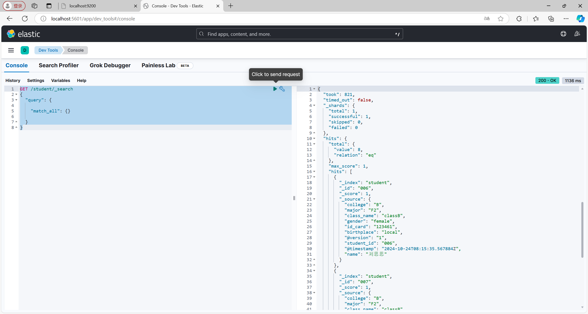
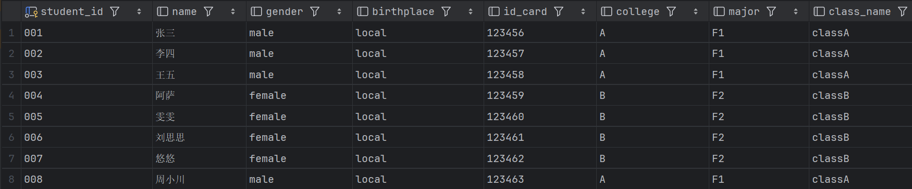
